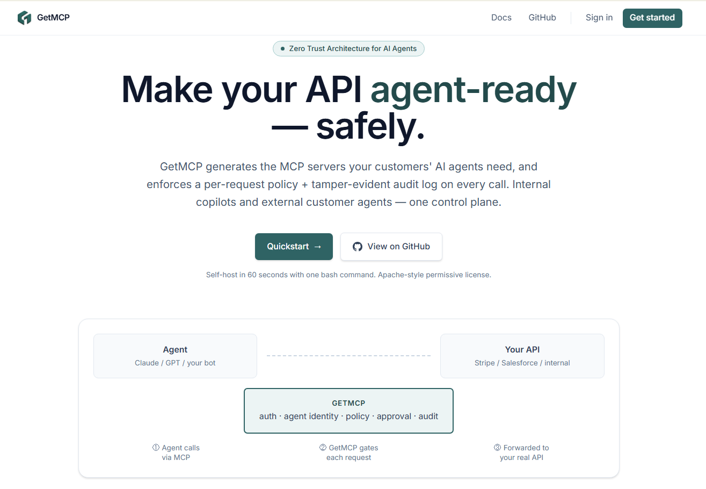

<div align="center">
  
  <h1>GetMCP</h1>
  <p><strong>Zero Trust for AI agents.</strong> Generates the MCP servers your customers' agents need, then enforces who can do what — per request, per agent, per tenant.</p>
  <p>
    <a href="LICENSE"></a>
    
    
    
    <a href="https://github.com/Rayenbabdallah/GetMCP/issues"></a>
  </p>
  <p>
    <a href="docs/quickstart.md"><strong>Quickstart →</strong></a> ·
    <a href="docs/security.md">Threat model</a> ·
    <a href="docs/operations.md">Operations</a> ·
    <a href="CHANGELOG.md">Changelog</a>
  </p>
</div>

---

> **TL;DR.** Point GetMCP at any OpenAPI spec. It generates two runnable MCP servers (Internal "god mode" and External "customer-safe"), then runs in front of them as a policy proxy with a tamper-evident audit log. Self-hosted, Apache 2.0, no telemetry.

<p align="center">
  
</p>

## What is GetMCP?

A **policy proxy + audit log** that sits between AI agents (Claude, ChatGPT, Cursor, your bots) and your existing API.

It does two things:

1. **Generates** Internal + External MCP servers from any OpenAPI spec, so your customers' AI agents can safely call your API.
2. **Enforces** Zero Trust on every call — per-agent identity, 5 policy rule types, Slack-mediated approval for sensitive mutations, and a tamper-evident audit log you can verify with one HTTP request.

```
   ┌─────────┐     ┌──────────────────────────────┐     ┌──────────┐
   │  AI     │ ──► │ GetMCP — auth · policy ·     │ ──► │ Your API │
   │  agent  │     │ approval · audit · stream    │     │          │
   └─────────┘     └──────────────────────────────┘     └──────────┘
```

**Built for**: B2B SaaS companies whose customers are starting to wire AI agents into their APIs and need a Zero Trust layer they can self-host.

**Not built for**: routing internal traffic between microservices (use a service mesh) or rate-limiting public APIs (use a CDN / WAF). GetMCP is specifically the AI-agent → enterprise-API path.

## Why not roll your own?

| You'd need to build | What GetMCP gives you on day 1 |
|---|---|
| Auth + per-tenant isolation, with regression tests proving Org A can't read Org B | Apache-2.0, working, tested |
| A streaming proxy with header filtering (no leaking caller `Authorization` to the upstream) | Real, with `502` / `504` mapped correctly, never `500` |
| A policy engine with deterministic priority order and a dry-run endpoint | 5 rule types, property-tested, `POST /policies/simulate` |
| A tamper-evident audit log your auditors will accept | sha256 hash chain, one-call `GET /audit/verify`, NDJSON export |
| A Slack approval flow with HMAC-signed callbacks | Idempotent state machine, replay-on-approve through the proxy |
| All of the above as a Helm chart with rolling deploys | Bundled, pre-install migration hook, no bundled DB |

About 6 months of work for one engineer. GetMCP is one bash command:

```bash
./deploy/scripts/bootstrap.sh
```

## Prerequisites
- Docker & Docker Compose
- Node.js 20+ (for local development) — see `.nvmrc`
- pnpm 9+
- PostgreSQL (if running outside of Docker)

## Documentation

Full operator + auditor docs in [`docs/`](docs/). Start with [`docs/quickstart.md`](docs/quickstart.md) — zero to a proxied request in 10 minutes. Live Swagger UI at `/docs` when the API is running in dev or with `ENABLE_DOCS=true`.

## Quick Start (one command)

```bash
git clone https://github.com/Rayenbabdallah/GetMCP
cd GetMCP
./deploy/scripts/bootstrap.sh
```

The bootstrap script generates `.env` with fresh `POSTGRES_PASSWORD` + `KEY_ENCRYPTION_KEY`, brings up Postgres, runs migrations, starts API + Web, and seeds a demo org. Re-runnable safely. Output prints a working API key (saved exactly once) and curl commands.

Defaults: dashboard at `http://localhost:8080`, API at `http://localhost:3000`. Kubernetes deploy via Helm chart in `deploy/helm/getmcp/`. Full operations runbook in `docs/operations.md`.

## Testing

- Strategy + claim → test mapping: [`docs/testing.md`](docs/testing.md)
- Per-file coverage gates on the 12 correctness-critical files (`apps/api/package.json#jest.coverageThreshold`); CI blocks merge on regression
- Property tests for the audit chain: 200 random inserts verified end-to-end, 50 random tampers all detected at the right `seq`
- Cross-rule combination tests for the policy engine — priority interactions, source filters, bypass behavior

## Performance

- Targets and tuning knobs: [`docs/performance.md`](docs/performance.md)
- Load tests: `deploy/load/k6-baseline.js` asserts SLA thresholds (p95 < 25ms simulate, p95 < 50ms proxy, < 1% errors). See `deploy/load/README.md` for invocation.
- Caches: 5s in-memory TTL on policy rules + agent identities. Audit writes are fire-and-forget off the response path.
- Compression enabled for JSON responses, **explicitly skipped on `/proxy/execute`** so the streamed upstream response isn't buffered.
- For multi-replica deploys: tune `?connection_limit=` in `DATABASE_URL` (default 3 on a 1-vCPU pod is too low for 1000 RPS).

## Security

- Threat model + data-at-rest catalog: [`docs/security.md`](docs/security.md)
- Vulnerability disclosure: [`SECURITY.md`](SECURITY.md) (rayenbenabdallah88@gmail.com)
- CI gates: `pnpm audit --audit-level=high` + GitHub CodeQL (`security-extended` suite) on every PR
- DTO validation: `class-validator` decorators on every body, `forbidNonWhitelisted: true` rejects extra fields
- Secrets at rest: AES-256-GCM (upstream auth, Slack tokens) + scrypt (API keys); the audit chain is sha256-linked and externally verifiable

## Production deploy

- **Docker Compose**: `docker compose -f docker-compose.prod.yml up -d` after `bootstrap.sh`. Healthchecks, restart policies, log rotation, resource limits, and the migrate-before-start ordering are all wired in.
- **Kubernetes (Helm)**: `helm install getmcp deploy/helm/getmcp -n getmcp --set ingress.host=...`. Pre-install Helm hook runs `prisma migrate deploy`; rolling deploy uses `maxSurge:1, maxUnavailable:0`. Chart deliberately does NOT bundle Postgres — bring your own (Marketplace Neon, RDS, Cloud SQL).
- **Backups**: `./deploy/scripts/backup-db.sh` (compressed `pg_dump` + retention prune); restore via `./deploy/scripts/restore-db.sh`. Always re-run `GET /audit/verify` after a restore — the chain must report `valid: true`.

See `docs/operations.md` for the full runbook (upgrades, rolling secrets, common incidents, alerting thresholds).

## Local development

```bash
pnpm install
pnpm dev          # runs API and web concurrently
pnpm typecheck    # whole monorepo
pnpm lint
pnpm test
```

## Architecture overview

- **`apps/api` (NestJS):** The core intelligence engine. It parses OpenAPI specs, generates Two-MCP trust boundaries, and runs the Proxy Interceptor to evaluate real-time agent requests against your policies.
- **`apps/web` (React/Vite):** The enterprise dashboard for managing policies, generating infrastructure, and viewing audit logs.
- **`docker-compose.yml`**: Container orchestration for local and beta deployments.

## Generator

GetMCP turns an OpenAPI spec into two runnable MCP servers (Internal + External). Endpoints are scored by an LLM classifier on four axes (data sensitivity, mutation impact, tenant scope, reversibility), cached by canonical spec hash, and overridable per endpoint by your security team.

```bash
KEY=<your-gmcp_-key>

# Classify (cached on second call for the same spec — no LLM cost)
curl -X POST http://localhost:3000/generator/classify \
  -H "Authorization: Bearer $KEY" -H "Content-Type: application/json" \
  -d '{"openapiUrl":"https://petstore3.swagger.io/api/v3/openapi.json"}'

# Flip an endpoint manually (or clear with "exposeExternally": null)
curl -X POST http://localhost:3000/generator/override \
  -H "Authorization: Bearer $KEY" -H "Content-Type: application/json" \
  -d '{"specHash":"...","path":"/admin/users","method":"delete","exposeExternally":true,"reason":"audited"}'

# Generate the Two-MCP split (uses cached classifications + overrides)
curl -X POST http://localhost:3000/generator/generate \
  -H "Authorization: Bearer $KEY" -H "Content-Type: application/json" \
  -d '{"openapiUrl":"https://petstore3.swagger.io/api/v3/openapi.json"}'

# Download the runnable scaffold (zip)
curl -G "http://localhost:3000/generator/export" \
  -H "Authorization: Bearer $KEY" --data-urlencode "openapiUrl=..." -o getmcp.zip
```

The exported zip contains real, runnable Node MCP servers — pinned `@modelcontextprotocol/sdk@1.0.4`, one tool per (method, path), reads `schema.json` at startup, forwards calls to `UPSTREAM_BASE_URL` via fetch. `cd internal-mcp && npm install && UPSTREAM_BASE_URL=... npm start` works out of the box.

Set `ANTHROPIC_API_KEY` to enable the LLM classifier. Without it, the generator falls back to keyword heuristics (deterministic, no network call, lower accuracy).

## Operability

- **Logs**: structured JSON via pino, one line per request. Each line carries `req.id` (sourced from `x-request-id` header or generated). Override level with `LOG_LEVEL=debug|info|warn|error|silent`.
- **Health**: `GET /health/live` (process up), `GET /health/ready` (DB reachable). Both `@Public`.
- **Metrics**: `GET /metrics` exposes Prometheus text. Series:
  - `getmcp_proxy_requests_total{action,source,upstream_status}` — proxy outcomes
  - `getmcp_proxy_request_duration_ms_bucket{action,source}` — controller-entry to response-finish latency histogram
  - `getmcp_policy_decisions_total{kind}` — engine outcome distribution
  - `getmcp_audit_writes_total{result}` — `ok` vs `failed` audit writes (the headline reliability metric)
  - `getmcp_approval_events_total{event}` — created / approved / denied / expired
  - Plus `getmcp_*` Node defaults (CPU, heap, event loop lag).
- **Migrations**: `prisma migrate` is the deploy path; `db push` is gone. Initial migration committed under `apps/api/prisma/migrations/20260515000000_init`.
- **Shutdown**: `enableShutdownHooks()` on SIGINT/SIGTERM drains in-flight requests, closes Prisma, stops the approval sweeper.

## Authentication

Every API endpoint (except `/health`) requires an `Authorization: Bearer <api-key>` header scoped to an Organization. Keys are minted by the seed script and via the `/orgs` endpoints (see `apps/api/src/auth`). All Prisma queries are filtered by the authenticated organization — see the tenant-isolation tests in `apps/api/src/auth/auth.spec.ts`.

## Configuring an upstream

The proxy forwards requests to a per-organization downstream API. Set it via:

```bash
KEY=<your-gmcp_-key>
curl -X PATCH http://localhost:3000/orgs/me \
  -H "Authorization: Bearer $KEY" \
  -H "Content-Type: application/json" \
  -d '{
    "upstreamBaseUrl": "https://api.stripe.com",
    "upstreamAuthHeader": "Bearer sk_test_...",
    "upstreamTimeoutMs": 10000
  }'
```

`upstreamAuthHeader` is encrypted at rest with `KEY_ENCRYPTION_KEY` (AES-256-GCM) and never returned by the API. Then call:

```bash
curl -X POST http://localhost:3000/proxy/execute \
  -H "Authorization: Bearer $KEY" \
  -H "x-agent-source: internal_mcp" \
  -H "Content-Type: application/json" \
  -d '{"method":"GET","path":"/v1/charges"}'
```

The upstream's status code, headers, and body stream through faithfully. Upstream timeouts return `504`, connection errors return `502`.

## Agents

`POST /proxy/execute` requires the caller to assert which agent they're acting as via the `x-agent-id` header. The agent must belong to the authenticated org and not be revoked or disabled.

```bash
KEY=<your-gmcp_-key>
# create an agent
AGENT_ID=$(curl -s -X POST http://localhost:3000/agents \
  -H "Authorization: Bearer $KEY" -H "Content-Type: application/json" \
  -d '{"name":"my-bot","source":"internal_mcp"}' | jq -r .id)

# use it
curl -X POST http://localhost:3000/proxy/execute \
  -H "Authorization: Bearer $KEY" \
  -H "x-agent-id: $AGENT_ID" \
  -H "x-agent-source: internal_mcp" \
  -H "Content-Type: application/json" \
  -d '{"method":"GET","path":"/v1/charges"}'

# revoke (takes effect within 5s on this instance)
curl -X DELETE http://localhost:3000/agents/$AGENT_ID -H "Authorization: Bearer $KEY"
```

## Policy engine

Five rule types, evaluated in `priority asc, createdAt asc` order. First terminal decision wins.

| ruleType | What it does | actionConfig |
|---|---|---|
| `ALLOWLIST` | Short-circuits to allow; skips later BLOCK/RATE_LIMIT for this match. | — |
| `BLOCK` | Terminal deny → `403`. | — |
| `AUDIT` | Rejects requests whose `x-agent-reasoning` is missing, < 10 chars, or boilerplate (`test`, `placeholder`, etc.). | — |
| `RATE_LIMIT` | Token bucket per `(orgId, agentId, tenantId)`. Returns `429` with `Retry-After`. External agents only. | `{"limit":50,"windowMs":60000,"scope":"agent+tenant"}` |
| `MUTATION_APPROVAL` | Holds the request, returns `202 AWAITING_APPROVAL`, fires Slack stub (real flow lands in §7). External agents only. | `{"channel":"#finance-ops"}` |

Path templates support exact (`/v1/refunds`), params (`/v1/users/:id`), prefix (`/v1/foo/*`), and `*`. Old `String.includes` matching is gone — `/v1/refunds-undo` no longer matches `/v1/refunds`.

```bash
KEY=<your-gmcp_-key>

# Full CRUD
curl http://localhost:3000/policies -H "Authorization: Bearer $KEY"
curl -X POST http://localhost:3000/policies -H "Authorization: Bearer $KEY" \
  -H "Content-Type: application/json" \
  -d '{"name":"block deletes","ruleType":"BLOCK","targetMethod":"DELETE","targetPath":"/v1/*","priority":10}'
curl -X PATCH http://localhost:3000/policies/ID -H "Authorization: Bearer $KEY" \
  -H "Content-Type: application/json" -d '{"isActive":false}'
curl -X DELETE http://localhost:3000/policies/ID -H "Authorization: Bearer $KEY"

# Dry-run: shows which rules fire and why, without forwarding upstream
curl -X POST http://localhost:3000/policies/simulate -H "Authorization: Bearer $KEY" \
  -H "Content-Type: application/json" \
  -d '{"method":"DELETE","path":"/v1/refunds/abc","source":"external_mcp","tenantId":"t-1","reasoning":"customer #321 requested rollback"}'
```

## Slack approval flow

A `MUTATION_APPROVAL` rule holds the request, posts an interactive Approve/Deny card to Slack, and returns `202` with a `pendingId`. The original caller polls `GET /approvals/:id` until status leaves `PENDING`.

**Configure once per org:**

```bash
curl -X PATCH http://localhost:3000/orgs/me \
  -H "Authorization: Bearer $KEY" -H "Content-Type: application/json" \
  -d '{
    "slackBotToken": "xoxb-...",
    "slackSigningSecret": "abc123...",
    "slackDefaultChannel": "#approvals"
  }'
```

Both Slack secrets are AES-256-GCM encrypted at rest. Point your Slack app's **Interactivity Request URL** at `https://your-getmcp/slack/interactions` — the endpoint verifies signatures (`v0` HMAC-SHA256, ±5min replay window).

**Lifecycle:**

1. Caller `POST /proxy/execute` → policy fires `MUTATION_APPROVAL` → response is `202 { pendingId, pollUrl, expiresAt }`. Default TTL 15 min.
2. Slack message has Approve/Deny buttons. The clicker's identity is recorded in the audit log.
3. On Approve: request is replayed through the proxy with `bypassApproval=true` (other rules — BLOCK / RATE_LIMIT / AUDIT — still apply). Upstream response is captured (status + headers + body up to 256KB).
4. On Deny / Expire: a BLOCKED audit row is written, no upstream call is made.
5. Caller polls `GET /approvals/:id` → eventually receives `{status, responseStatus, responseHeaders, responseBody}`.

A background sweeper expires PENDING rows past their TTL every 30s.

## Audit ledger

Every proxy call writes one tamper-evident `AuditLog` row to a per-organization hash chain. Quick checks:

```bash
KEY=<your-gmcp_-key>
curl -H "Authorization: Bearer $KEY" http://localhost:3000/audit | jq
curl -H "Authorization: Bearer $KEY" http://localhost:3000/audit/verify
curl -H "Authorization: Bearer $KEY" http://localhost:3000/audit/export -o audit.ndjson
```

Schema, hash construction, and integrity guarantees are documented in `docs/audit.md`.

## Roadmap

Tracked publicly as design-discussion issues — comment if you have a take, PRs welcome:

- [Approval ergonomics — mitigate rubber-stamp risk](https://github.com/Rayenbabdallah/GetMCP/issues/1)
- [BEHAVIORAL_ANOMALY rule type — close the right-shape-wrong-volume gap](https://github.com/Rayenbabdallah/GetMCP/issues/2)
- [Policy lifecycle — versioning, drift detection, audit-of-audit](https://github.com/Rayenbabdallah/GetMCP/issues/3)
- [Signed agent configs — sigstore-style provenance for generator output](https://github.com/Rayenbabdallah/GetMCP/issues/4)


See [`CHANGELOG.md`](CHANGELOG.md) for what shipped in `v0.1.0`. Roadmap is tracked in [GitHub Issues](https://github.com/Rayenbabdallah/GetMCP/issues) and [Discussions](https://github.com/Rayenbabdallah/GetMCP/discussions).

## Contributing

PRs welcome — see [`CONTRIBUTING.md`](CONTRIBUTING.md) for the dev loop, coverage policy, and what kinds of changes we're looking for. Discussion before code on anything touching auth, the audit chain, or migrations. Be a good neighbour: [`CODE_OF_CONDUCT.md`](CODE_OF_CONDUCT.md).

For security issues, **do not file public issues** — see [`SECURITY.md`](SECURITY.md) for the disclosure SLA.

## License

GetMCP is licensed under the [Apache License 2.0](LICENSE). © 2026 Rayen Babdallah and GetMCP contributors. See [`NOTICE`](NOTICE).
